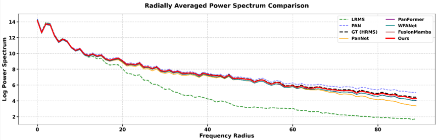

# ICML 2026 Supplementary Material: Frequency Analysis

This page provides supplementary frequency-domain analysis to support our response to the reviewers' comments regarding high-frequency information recovery.

---

## Response to Weakness 4: High-Frequency Compensation Analysis

To further validate the effectiveness of the proposed method in recovering high-frequency information, we provide an analysis of the **Radially Averaged Power Spectrum (RAPS)**. This metric illustrates the distribution of spectral energy across different frequencies, comparing our fused results against the Ground Truth (GT) and other representative methods.

### Spectral Power Distribution Comparison

**Observations from the RAPS analysis:**

1. **High Spectral Consistency:** Our proposed method (Red Curve) maintains a high level of consistency with the GT spectral curve across the entire frequency range. Notably, in the **high-frequency region** (right side of the x-axis), our curve matches the GT most closely, demonstrating superior detail recovery capability.
2. **Comparison with Competitors:** Existing methods such as **WFANet** and **FusionMamba** exhibit spectral curves that are noticeably lower than the GT, especially in mid-to-high frequencies. This indicates a **low-frequency bias**, where competing methods tend to produce over-smoothed results, leading to the loss of sharp textures and structural details.
3. **Rationality of Design:** The results confirm that our model effectively compensates for high-frequency information without causing "spectral overshoot" (excessive noise). This validates that the integration of **MFil-SSM** and its orthogonal gradient priors successfully captures structural contours that are often lost in standard SSM-based fusion.

---
*Note: This repository is anonymized for double-blind review.*
